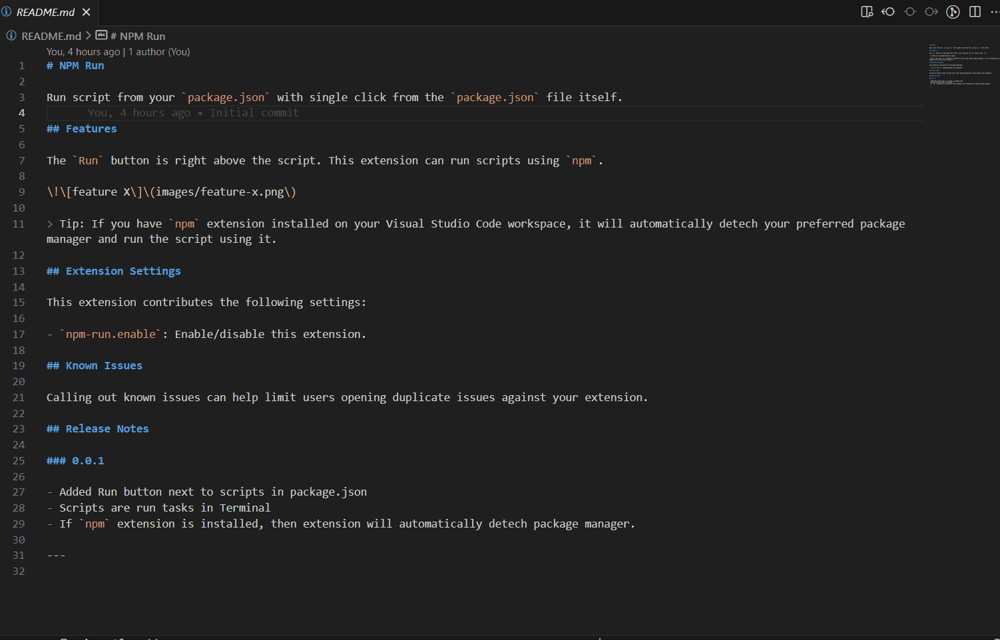

# NPM Run

Run script from your `package.json` with single click from the `package.json` file itself.

## Features

The `Run` button is right above the script.

> Contrary to the extension name, this extension can run scripts using your preferred package manager not just `npm`.

## Extension Settings

This extension contributes the following settings:

- `npm-run.enable`: Enable/disable this extension.

---
